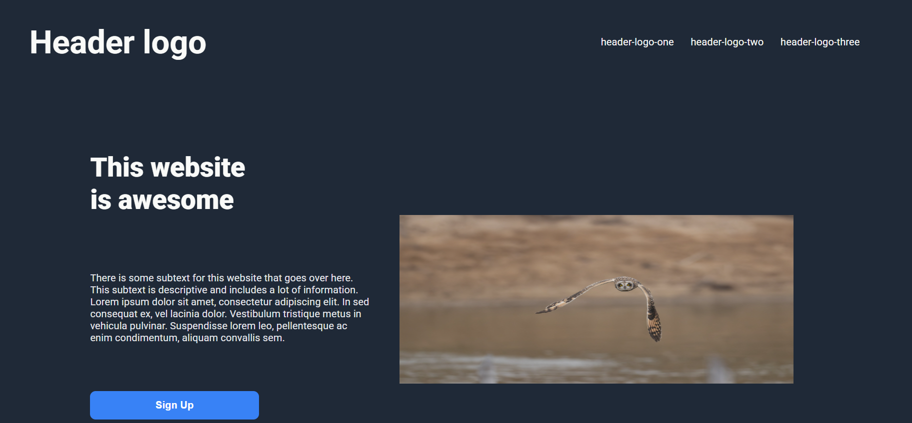

# Landing Page
A responsive landing page built as part of The Odin Project Foundations course.

🔗 Live Demo: https://umamanasir.github.io/landing-page/


# Screenshot: 



## About
This project is part of the Foundations curriculum, focused on practicing HTML structure and CSS styling by building a landing page from a design mockup.


## Built With
- HTML5
- CSS3 (Flexbox / Grid)
- No frameworks or libraries — vanilla only


## What I Practiced
- Structuring a page with semantic HTML
- Styling with CSS Flexbox for layout
- Working from a design mockup
- Aligning multiple items of different sizes. 

## Running Locally
- Clone the repository
``` bash
   git clone https://github.com/umamanasir/landing-page
```
- Open index.html in your browser.


## Acknowledgments
- Design from The Odin Project
- Photo by <a href="https://unsplash.com/@amhurley?utm_source=unsplash&utm_medium=referral&utm_content=creditCopyText">Alyssa Hurley</a> on <a href="https://unsplash.com/photos/white-textile-in-close-up-photography-yekIZ4ltv1o?utm_source=unsplash&utm_medium=referral&utm_content=creditCopyText">Unsplash</a> 
- Photo by <a href="https://unsplash.com/@metropolitanmuseum?utm_source=unsplash&utm_medium=referral&utm_content=creditCopyText">The Metropolitan Museum of Art</a> on <a href="https://unsplash.com/photos/quill-pen-and-books-still-life-1RhLqMtdK8U?utm_source=unsplash&utm_medium=referral&utm_content=creditCopyText">Unsplash</a>